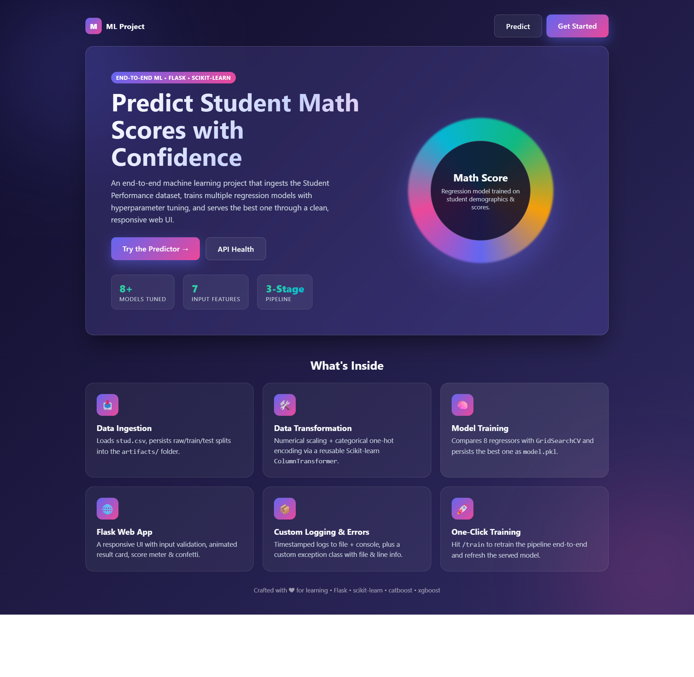
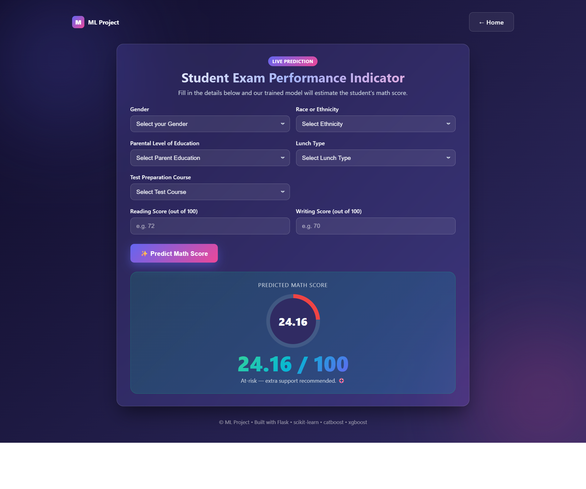

# 🎓 Student Performance Predictor — End-to-End ML Project

> A **production-style**, refactored & beautified version of the classic *"End To End Data Science Project"* tutorial by **Krish Naik**. Predicts a student's **Math Score** from demographic & academic features through a clean modular pipeline and a colorful animated Flask UI.

<p align="center">
  <a href="https://www.youtube.com/watch?v=1m3CPP-93RI&t=14596s">
    
  </a>
  
  
  
  
  
  
  
</p>

<p align="center">
  <a href="#-demo"></a>
  <a href="#-quick-start"></a>
  <a href="#-api"></a>
  <a href="#-architecture"></a>
</p>

---

## ✨ Highlights

<table>
<tr>
<td width="50%" valign="top">

### 🧠 **ML Pipeline**
- 📥 **Data Ingestion** — Loads `stud.csv`, persists train/test splits to `artifacts/`
- 🛠️ **Data Transformation** — Numerical scaling + categorical one-hot encoding (`ColumnTransformer`)
- 🧪 **Model Training** — `GridSearchCV` across **8 regressors**, best model saved as `model.pkl`

</td>
<td width="50%" valign="top">

### 🎨 **Web UI**
- 🌈 Animated gradient background with floating color blobs
- 🪟 Glassmorphism cards, smooth fade-up & pop animations
- 🎯 Animated score-meter ring + 🪅 confetti on prediction
- 📱 Fully responsive (mobile → desktop)

</td>
</tr>
<tr>
<td width="50%" valign="top">

### ⚙️ **Engineering**
- 🪵 Custom timestamped logger (file + console handlers)
- 🚨 Custom exception class with file & line number
- 💾 Pickled artifacts via `dill`
- 🧱 `setup.py` based packaging (`-e .` install)

</td>
<td width="50%" valign="top">

### 🔌 **API Endpoints**
- `GET /` — Landing page
- `GET|POST /predictdata` — Predict math score
- `GET /train` — Retrain pipeline end-to-end
- `GET /health` — JSON health & artifact check

</td>
</tr>
</table>

---

## 📸 Demo

<p align="center">
  
  
</p>

<p align="center">
  
</p>

---

## 🧩 Architecture

```
┌──────────────────┐    ┌────────────────────┐    ┌────────────────────┐
│   Data Source    │──▶ │   Data Ingestion   │──▶ │  Data Transformation│
│  stud.csv        │    │   (src/components) │    │  (ColumnTransformer)│
└──────────────────┘    └────────────────────┘    └─────────┬──────────┘
                                                           │
                                                           ▼
                        ┌────────────────────┐    ┌────────────────────┐
                        │   Flask Web App    │◀── │  Model Trainer     │
                        │   (templates + UI) │    │  (GridSearchCV x8) │
                        └────────────────────┘    └────────────────────┘
```

---

## 🚀 Quick Start

Pick the workflow that fits your machine. All three end up with the same running app.

---

### 🪟 Option A — Conda (Windows-friendly, prefix env)

```cmd
:: 1) Open the project in VS Code
code .

:: 2) Create a local Conda env (prefix style, no global registration)
conda create -p venv python==3.8 -y

:: 3) (One-time) enable 'conda activate' in cmd
conda init
::     **Close & reopen your terminal** so the changes take effect.

:: 4) Activate the env
conda activate venv\

:: 5) Install dependencies + editable package
pip install -r requirements.txt
pip install -e .
```

> 💡 `conda activate venv\` works because the env was created with a **prefix path** (`-p venv`) — that's why the trailing `\` is required on Windows.

---

### 🐍 Option B — `venv` (built-in, no Conda)

**Windows (cmd / PowerShell):**
```cmd
python -m venv venv
venv\Scripts\activate
pip install -r requirements.txt
pip install -e .
```

**macOS / Linux:**
```bash
python3 -m venv venv
source venv/bin/activate
pip install -r requirements.txt
pip install -e .
```

---

### 🧪 Option C — Conda with `environment.yml`

If you prefer a fully reproducible environment from a YAML file:

```cmd
conda env create -f environment.yml
conda activate mlproject
pip install -e .
```

A ready-to-use `environment.yml` is provided — see below.

---

### ⚡ One-click helpers (optional)

- **Windows:** double-click `setup-windows.cmd`
- **macOS / Linux:** `bash setup.sh`

Both scripts create the env, install deps and print the next steps.

---

### 🧠 Train the model

```bash
# Option 1 — trigger via the API
python app.py
# then visit http://127.0.0.1:5000/train

# Option 2 — direct CLI
python -m src.pipeline.train_pipeline
```

This produces:

```
artifacts/
├── data.csv         # raw ingested data
├── train.csv        # 80% split
├── test.csv         # 20% split
├── preprocessor.pkl # ColumnTransformer
└── model.pkl        # best model
```

---

### ▶️ Run the app

```bash
python app.py
```

Then open **<http://127.0.0.1:5000/>** in your browser.

---

## 🔌 API

| Method | Route           | Description                                          |
| :----- | :-------------- | :--------------------------------------------------- |
| `GET`  | `/`             | Colorful landing page                                |
| `GET`  | `/predictdata`  | Render the prediction form                           |
| `POST` | `/predictdata`  | Predict the math score from form fields              |
| `GET`  | `/train`        | Retrain the end-to-end pipeline                      |
| `GET`  | `/health`       | JSON health-check incl. artifact existence          |

### Example: `POST /predictdata`

```bash
curl -X POST http://127.0.0.1:5000/predictdata \
  -d "gender=female" \
  -d "race_ethnicity=group B" \
  -d "parental_level_of_education=bachelor's degree" \
  -d "lunch=standard" \
  -d "test_preparation_course=completed" \
  -d "reading_score=88" \
  -d "writing_score=92"
```

Returns the rendered HTML containing the predicted score.

---

## 🗂️ Project Structure

```
ML_Project/
├── app.py                         # Flask entry-point + routes
├── setup.py                       # Package configuration
├── requirements.txt
├── LICENSE
├── README.md
├── .env.example
├── artifacts/                     # Generated at train-time
│   ├── data.csv
│   ├── train.csv / test.csv
│   ├── preprocessor.pkl
│   └── model.pkl
├── logs/                          # Timestamped log files
├── notebook/
│   ├── data/stud.csv
│   ├── 1 . EDA STUDENT PERFORMANCE .ipynb
│   └── 2. MODEL TRAINING.ipynb
├── src/
│   ├── components/
│   │   ├── data_ingestion.py
│   │   ├── data_transformation.py
│   │   └── model_trainer.py
│   ├── pipeline/
│   │   ├── train_pipeline.py
│   │   └── predict_pipeline.py
│   ├── utils.py
│   ├── logger.py
│   └── exception.py
├── static/
│   ├── css/style.css              # Global styles
│   └── js/main.js                 # UI polish (confetti, meter)
└── templates/
    ├── index.html                 # Landing page
    └── home.html                  # Prediction form
```

---

## 🧪 Models Compared

| Model                   | Tuned? |
| :---------------------- | :----: |
| Linear Regression       |   ✅   |
| Decision Tree           |   ✅   |
| Random Forest           |   ✅   |
| Gradient Boosting       |   ✅   |
| K-Neighbors Regressor   |   ✅   |
| XGBRegressor            |   ✅   |
| CatBoosting Regressor   |   ✅   |
| AdaBoost Regressor      |   ✅   |

The best model (by R² on the test set) is auto-selected and serialized to `artifacts/model.pkl`.

---

## 🛡️ Error Handling & Logging

- All exceptions go through `CustomException`, which enriches messages with **file name** and **line number**.
- Logs go to both `logs/<timestamp>.log` and the console.
- Input validation protects against out-of-range scores and missing artifacts.

---

## 🧰 Tech Stack

<p align="center">
  
  
  
  
  
  
  
  
  
  
</p>

---

## 🗺️ Roadmap

- [x] Colorful animated UI with confetti & score meter
- [x] Robust error handling & input validation
- [x] Configurable artifact paths (BASE_DIR-based)
- [x] `/train` & `/health` API routes
- [ ] Dockerize the app
- [ ] Add CI (GitHub Actions) — lint + import sanity
- [ ] Add SHAP feature importance plot
- [ ] Add unit tests with `pytest`

---

## 🙏 Credits & Inspiration

This project is a **refactored, beautified & extended** version of the
**"End To End Data Science Project"** tutorial by **Krish Naik** — a key resource
in the *Master AI & Data Science with Krish Naik* YouTube series.

> 🎥 Original tutorial:
> [**End To End Data Science Project — Krish Naik**](https://www.youtube.com/watch?v=1m3CPP-93RI&t=14596s)

The original walkthrough laid the foundation for the **modular pipeline**
(`data_ingestion → data_transformation → model_trainer`) and the
**Flask-based prediction UI**.

### What this version adds on top
- 🎨 **Colorful animated UI** — gradient background, glassmorphism, floating orbs, confetti & score-meter ring
- 🛡️ **Robust error handling** — typed exception handlers, input validation, missing-artifact guards
- ⚙️ **Engineering hardening** — `BASE_DIR`-based artifact paths, UTF-8 logger, `n_jobs` parallelized `GridSearchCV`
- 🔌 **New API routes** — `/train` for one-click retraining, `/health` for JSON status
- 📚 **Professional docs** — `LICENSE`, `environment.yml`, multi-platform setup helpers
- 🐍 **Multiple setup paths** — Conda (prefix env), `venv`, `environment.yml`, one-click `.cmd` / `.sh`

| | Original Tutorial | This Repo |
| :--- | :---: | :---: |
| Modular ML pipeline | ✅ | ✅ |
| Flask web UI | ✅ | ✅ |
| 8-model hyperparameter tuning | ✅ | ✅ |
| Custom logger & exception | ✅ | ✅ (UTF-8 + dual handler) |
| Colorful UI / animations | ❌ | ✅ |
| `/train` & `/health` API | ❌ | ✅ |
| Multi-platform setup | ❌ | ✅ |
| Pinned dependencies | ❌ | ✅ |

A huge thanks to **Krish Naik** for the clear, practical teaching that inspired this work. 🙏

---

## 🤝 Contributing

Contributions, issues and feature requests are welcome! Feel free to open an issue or PR.

---

## 📜 License

Distributed under the **MIT License**. See [`LICENSE`](./LICENSE) for the full text.

---

<p align="center">
  Made with ❤️ by <a href="mailto:muasfiahamed276@gmail.com">Asfi</a> • ⭐ this repo if you found it useful!
</p>